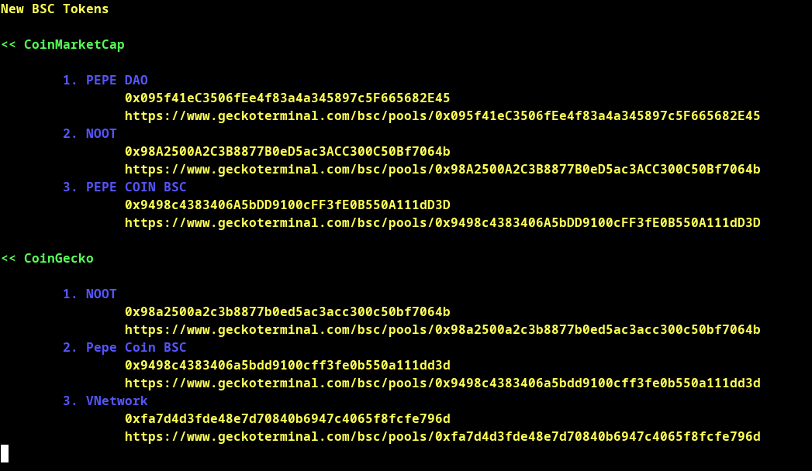

New BSC Token Tracker
=====

Script for discovering new BSC tokens once they appear in CoinGecko and CoinMarketCap listings. It runs in terminal continuously and plays alert sound if list changes ! Tested on Linux only.

Both public APIs do not provide direct way for accessing newly listed tokens, so have to rely on webscraping a lot. However script makes the job done.

## How to use
1. Run:
```bash
python freshCoins.py
```
2. Install whatever python modules script is asking for:
```bash
pip3 install termcolor
```
...


